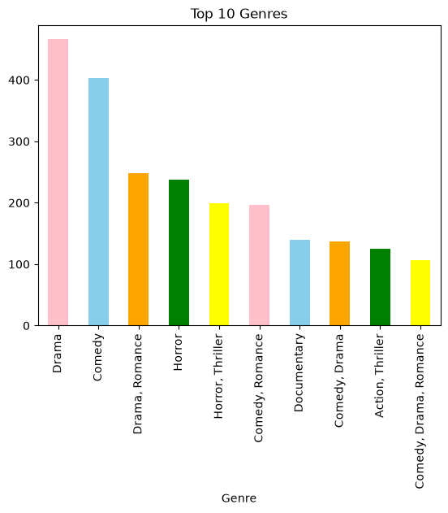
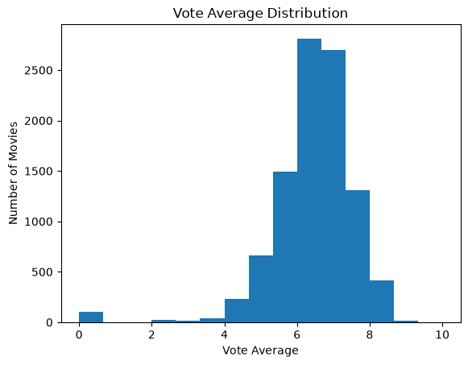
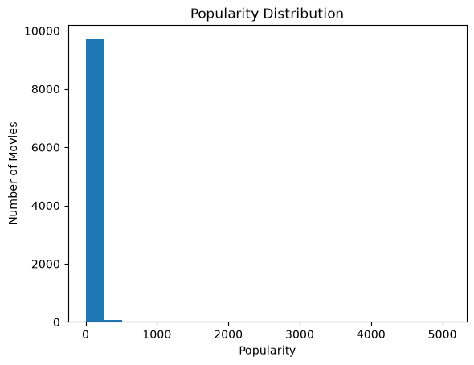

# 🍿 Popcorn Picks — Movie Database Analysis

<div align="center">


**A comprehensive Exploratory Data Analysis (EDA) of 9,837 movies — uncovering patterns in popularity, ratings, genres, languages, and global release trends.**

[📊 Live Demo (GitHub Pages)](https://yourusername.github.io/Popcorn-Picks/) · [📓 View Notebook](notebook/Popcorn_Picks.ipynb) · [📁 Dataset](data/mymoviedb.csv)

</div>

---

## 📸 Project Preview

> Open `index.html` in your browser to see the full interactive dashboard with 6 charts.

| Genre Distribution | Rating Distribution | Release Trends |
|:--:|:--:|:--:|
|  |  |  |

---

## 🎯 Objectives

- ✅ Clean and preprocess a real-world movie dataset
- ✅ Perform EDA to uncover hidden patterns and trends
- ✅ Analyze popularity, ratings, and audience engagement
- ✅ Explore genre and language distributions globally
- ✅ Visualize insights through interactive charts
- ✅ Build a professional, shareable web dashboard

---

## 📂 Project Structure

```text
Popcorn-Picks/
│
├── 📁 data/
│   └── mymoviedb.csv           # Raw movie dataset (9,837 rows)
│
├── 📁 images/
│   ├── genre_distribution.png
│   ├── rating_distribution.png
│   ├── popularity_distribution.png
│   ├── popularity_vs_rating.png
│   ├── language_distribution.png
│   ├── heatmap.png
│   └── pairplot.png
│
├── 📁 notebook/
│   └── Popcorn_Picks.ipynb     # Full Jupyter EDA notebook
│
├── 📄 index.html               # Interactive web dashboard
├── 📄 README.md                # Project documentation
├── 📄 requirements.txt         # Python dependencies
└── 📄 .gitignore
```

---

## 📊 Dataset Features

| Column | Description |
|--------|-------------|
| `Title` | Movie name |
| `Genre` | Genre(s) — comma-separated |
| `Popularity` | Popularity score (TMDB scale) |
| `Vote_Count` | Total audience votes |
| `Vote_Average` | Average audience rating (0–10) |
| `Original_Language` | Language code (e.g. `en`, `ja`) |
| `Release_Date` | Release date (YYYY-MM-DD) |
| `Overview` | Short movie description |
| `Poster_Url` | TMDB poster link |

---

## 🔍 Analysis Performed

### 🧹 Data Cleaning & Preprocessing
- Missing value identification and handling
- Duplicate record detection and removal
- Type conversion (dates, numeric columns)
- Feature engineering: `Year`, `Primary_Genre`

### 📐 NumPy-Based Statistical Analysis
- Mean, median, standard deviation
- Percentile analysis (25th, 50th, 75th)
- Outlier detection via IQR

### 🐼 Pandas-Based Insights
- Most popular & highest-rated movies
- Genre frequency and language distribution
- Year-wise release volume analysis
- Cross-tabulations and group aggregations

### 📈 Visualizations
| Chart | Library | Insight |
|-------|---------|---------|
| Popularity Distribution | Seaborn/Matplotlib | Right-skewed; few blockbusters dominate |
| Rating Distribution | Matplotlib | Most movies cluster 6–7.9 |
| Genre Distribution | Seaborn | Drama, Action, Comedy lead |
| Language Distribution | Matplotlib | English = 77% of dataset |
| Release Trend (2000–2022) | Seaborn | Near-tripling over 2 decades |
| Popularity vs. Rating | Matplotlib | Weak positive correlation |
| Correlation Heatmap | Seaborn | Vote count ↔ Popularity |
| Pairplot | Seaborn | Multi-variable relationships |

---

## 💡 Key Findings

1. **Popularity ≈ Engagement** — Higher vote counts consistently produce higher popularity scores.
2. **English Dominates** — 77% of films are English-language; Japanese (7%) is a distant second.
3. **Drama Leads Volume** — Drama, Action, and Comedy together account for ~50% of all releases.
4. **2021 Was Record Year** — 714 releases, driven by the streaming boom post-pandemic.
5. **Ratings Cluster in Middle** — 66%+ of movies score between 6.0–7.9; truly exceptional films are rare.
6. **Popularity is Skewed** — Mean = 40.3, Max = 5,083. Spider-Man: No Way Home is a 126× outlier.
7. **Asian Cinema Rising** — Japanese, Spanish, Korean, and French films make significant appearances.

---

## 🚀 Getting Started

### 1. Clone the Repository
```bash
git clone https://github.com/yourusername/Popcorn-Picks.git
cd Popcorn-Picks
```

### 2. Create a Virtual Environment (recommended)
```bash
python -m venv venv
# Windows:
venv\Scripts\activate
# macOS / Linux:
source venv/bin/activate
```

### 3. Install Dependencies
```bash
pip install -r requirements.txt
```

### 4. Run the Jupyter Notebook
```bash
jupyter notebook notebook/Popcorn_Picks.ipynb
```

### 5. View the Web Dashboard
Open `index.html` directly in your browser — no server needed.

---

## 🌐 Deploy to GitHub Pages (Free Hosting)

1. Push your project to GitHub
2. Go to **Settings → Pages**
3. Source: **Deploy from branch → main → / (root)**
4. Your dashboard will be live at `https://yourusername.github.io/Popcorn-Picks/`

---

## 🛠️ Tech Stack

| Tool | Purpose |
|------|---------|
| Python 3.10+ | Core language |
| NumPy | Numerical & statistical analysis |
| Pandas | Data manipulation & aggregation |
| Matplotlib | Static visualizations |
| Seaborn | Statistical plots |
| Jupyter Notebook | Interactive EDA environment |
| Chart.js | Interactive web charts |
| Git & GitHub | Version control & hosting |

---

## 🔮 Future Scope

- [ ] Sentiment analysis on movie overviews using NLP
- [ ] Movie recommendation engine using collaborative filtering
- [ ] Predictive model for popularity/rating using ML
- [ ] Interactive Streamlit dashboard
- [ ] TMDB API integration for live data

---

## 👩‍💻 Author

**Navdeep Kaur**

*Aspiring Data Analyst · Python Enthusiast · Exploring Data Through Insights and Visualization 🚀*

[](https://www.linkedin.com/in/navdeep-kaur-32b2a631b/)
[](https://github.com/navkaur62)

---

## 📄 License

This project is licensed under the MIT License — see [LICENSE](LICENSE) for details.

---

<div align="center">
  <sub>Built with ❤️ and lots of 🍿</sub>
</div>
